# Production Platform Engineering

A production-oriented infrastructure monitoring platform built using Docker Compose that demonstrates deployment, orchestration, monitoring, alerting, and visualization of containerized services.

The platform integrates Nginx, Prometheus, Grafana, Node Exporter, cAdvisor, and Alertmanager into a centralized monitoring environment. It also includes a custom Grafana dashboard, Prometheus alert rules, GitHub Actions CI, and production-style deployment practices.

---

# Features

## Infrastructure

- Docker Compose multi-container deployment
- Nginx web server
- Dedicated Docker bridge network
- Health checks
- Restart policies
- Persistent Docker volumes
- Environment variables using `.env`
- Container log rotation

---

## Monitoring & Observability

- Prometheus metrics collection
- Grafana dashboards
- Custom Production Dashboard
- Node Exporter integration
- cAdvisor integration
- Alertmanager integration
- Custom Prometheus alert rules
- Infrastructure health monitoring

---

## CI/CD

- GitHub Actions workflow
- Docker Compose validation
- YAML configuration verification
- Automated configuration checks

---

# Tech Stack

- Docker
- Docker Compose
- Nginx
- Prometheus
- Grafana
- Alertmanager
- Node Exporter
- cAdvisor
- PromQL
- YAML
- HTML
- CSS
- GitHub Actions

---

# Project Structure

```text
production-platform/

├── app/
│   └── index.html
│
├── monitoring/
│   ├── prometheus/
│   │   ├── prometheus.yml
│   │   └── alerts.yml
│   │
│   └── alertmanager/
│       └── alertmanager.yml
│
├── nginx/
│   ├── nginx.conf
│   ├── default.conf
│   ├── gzip.conf
│   ├── proxy.conf
│   └── security.conf
│
├── scripts/
│
├── docs/
│   ├── architecture/
│   ├── screenshots/
│   ├── Backup-Recovery.md
│   ├── Deployment-Guide.md
│   ├── Incident-Response.md
│   ├── Monitoring-Guide.md
│   └── Production-Checklist.md
│
├── .github/
│   └── workflows/
│       └── docker-ci.yml
│
├── docker-compose.yml
├── .env
├── README.md
└── LICENSE
```

---

# Architecture

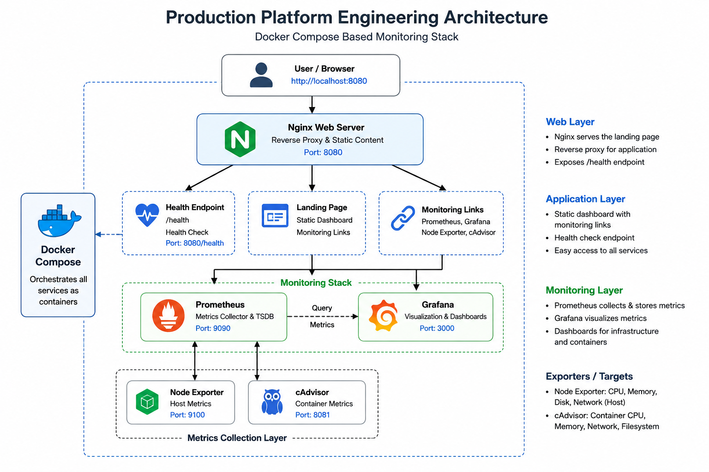

---

# Monitoring Components

## Nginx

- Hosts the Production Platform Dashboard
- Serves static content
- Exposes the `/health` endpoint

---

## Prometheus

- Collects infrastructure metrics
- Stores time-series data
- Executes PromQL queries
- Evaluates alert rules

---

## Grafana

- Visualizes infrastructure metrics
- Hosts imported dashboards
- Hosts the custom Production Dashboard
- Connects to Prometheus as the data source

---

## Node Exporter

Collects host-level metrics including:

- CPU Usage
- Memory Usage
- Disk Usage
- Network Statistics

---

## cAdvisor

Collects container metrics including:

- CPU Usage
- Memory Usage
- Filesystem Usage
- Network Usage

---

## Alertmanager

- Receives alerts from Prometheus
- Displays active alerts
- Groups and manages alert notifications
- Provides centralized alert management

---

# Services

| Service | Port |
|---------|------|
| Dashboard | 8080 |
| Prometheus | 9090 |
| Grafana | 3000 |
| Node Exporter | 9100 |
| cAdvisor | 8081 |
| Alertmanager | 9093 |

---

# Access Services

| Service | URL |
|---------|-----|
| Dashboard | http://localhost:8080 |
| Health Endpoint | http://localhost:8080/health |
| Prometheus | http://localhost:9090 |
| Grafana | http://localhost:3000 |
| Alertmanager | http://localhost:9093 |

---

# Getting Started

## Clone the Repository

```bash
git clone https://github.com/your-username/production-platform.git

cd production-platform
```

---

## Start the Platform

```bash
docker compose up -d
```

---

## Verify Running Containers

```bash
docker compose ps
```

Expected services:

- production-web
- prometheus
- grafana
- alertmanager
- node-exporter
- cadvisor

---

## Validate the Deployment

Verify the Docker Compose configuration:

```bash
docker compose config
```

Verify the running containers:

```bash
docker compose ps
```

Verify the Nginx configuration:

```bash
docker compose exec web nginx -t
```

Verify Prometheus targets:

```
http://localhost:9090/targets
```

Verify Alertmanager:

```
http://localhost:9093
```

---

## Stop the Platform

```bash
docker compose down
```

---

# Custom Production Dashboard

A custom Grafana dashboard was developed as part of this project to provide a centralized operational view of the platform.

The dashboard includes:

- Prometheus Status
- Node Exporter Status
- cAdvisor Status
- Running Containers
- Active Alerts
- Host CPU Usage
- Host Memory Usage
- Container CPU Usage
- Container Memory Usage

Unlike the imported community dashboards, this dashboard was built specifically for this project using custom PromQL queries.

---

# Alerting

Prometheus continuously evaluates alert rules defined in:

```
monitoring/prometheus/alerts.yml
```

Current alert rules include:

- PrometheusDown
- HighCPUUsage
- HighMemoryUsage
- ContainerDown

Alertmanager receives alerts from Prometheus and provides centralized alert management.

---

# Screenshots

## Dashboard Homepage

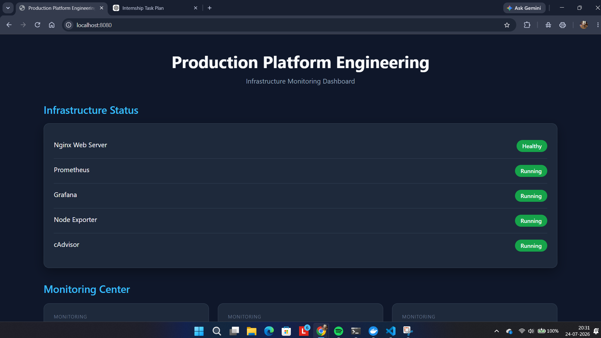

---

## Docker Compose

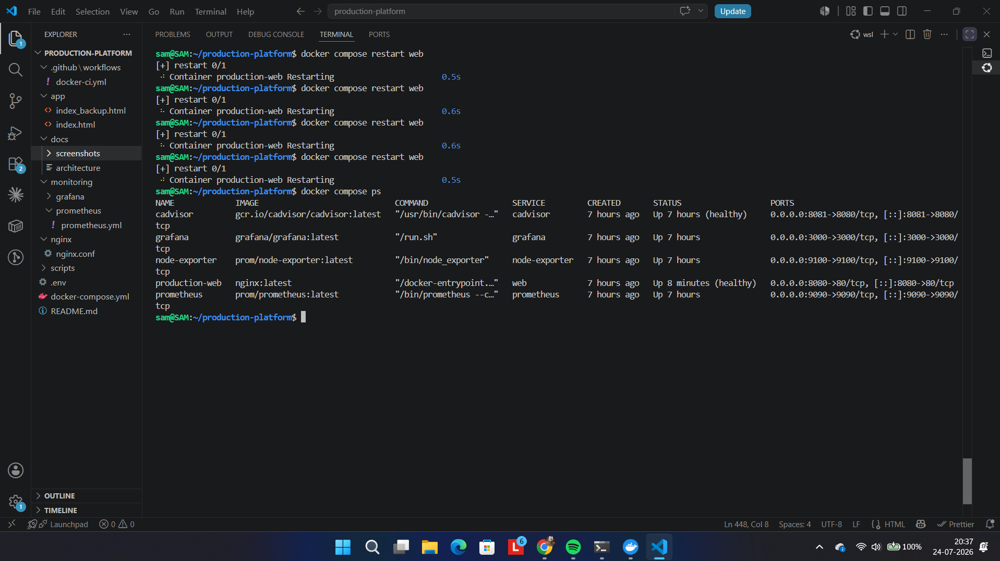

---

## Prometheus Targets

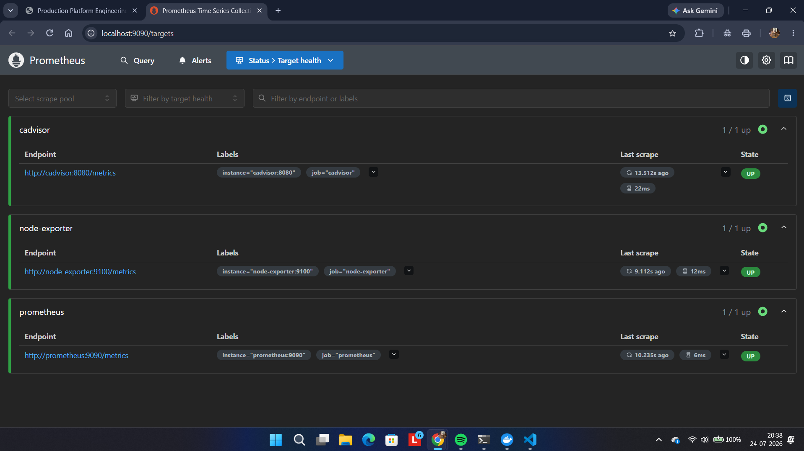

---

## Node Exporter Dashboard

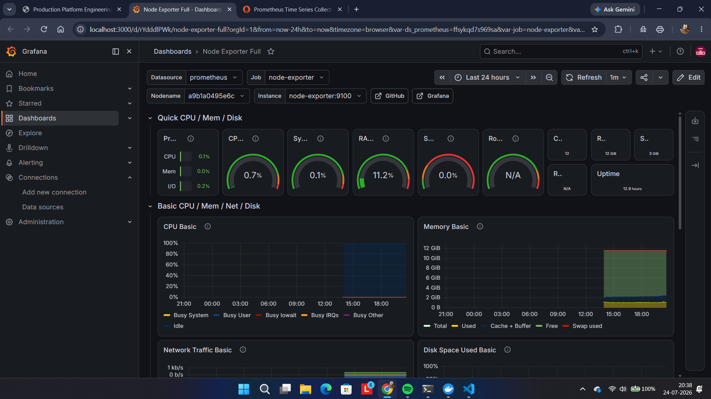

---

## cAdvisor Dashboard

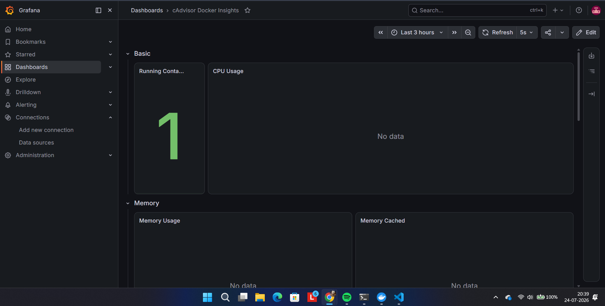

---

## Health Endpoint

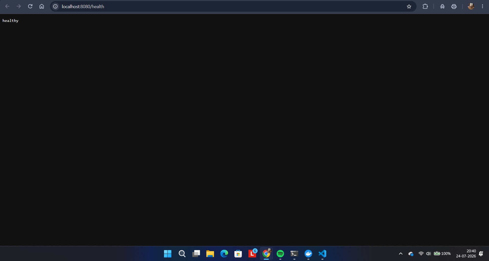

---

## Prometheus Alert Rules

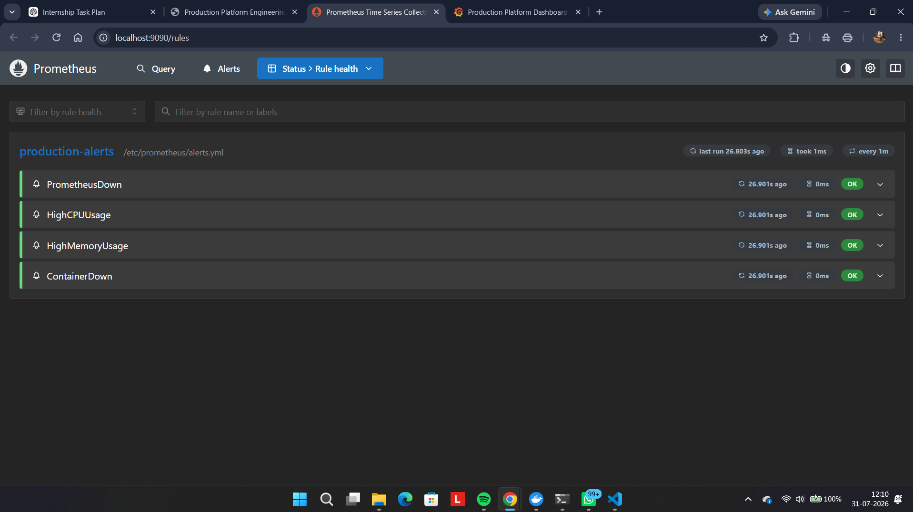

---

## Production Dashboard

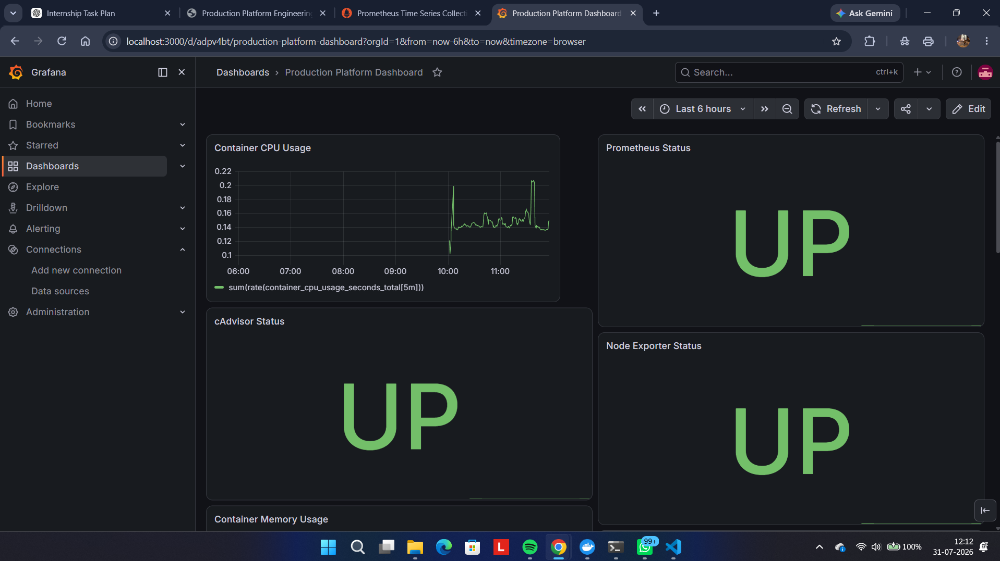

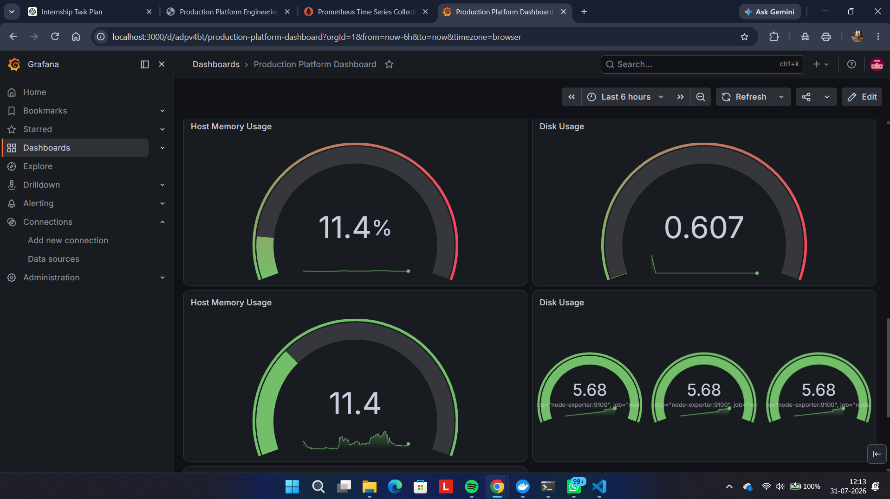

---

## Prometheus Alert

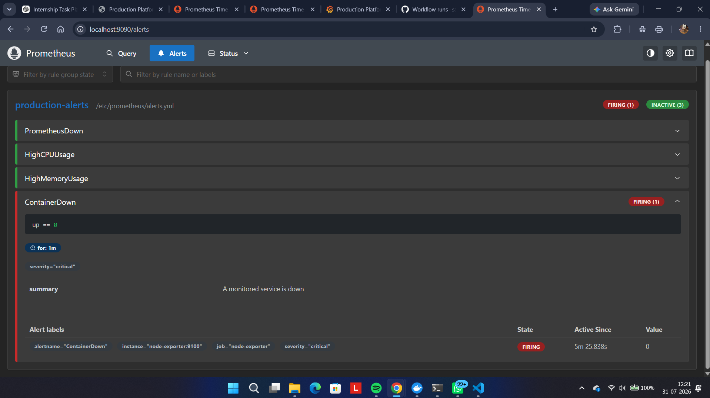

---

## Alertmanager

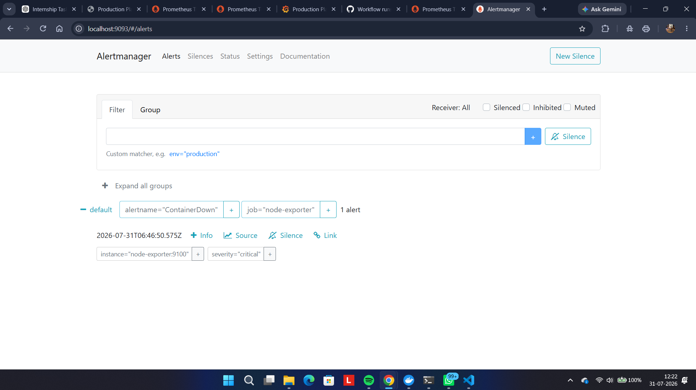

---

## GitHub Actions CI

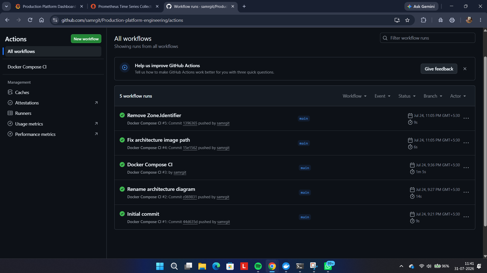

## Health Endpoint

```
docs/screenshots/11-health-endpoint.png
```

---

# Continuous Integration

GitHub Actions automatically validates the project whenever changes are pushed to the repository.

The workflow performs:

- Docker Compose configuration validation
- YAML configuration verification
- Build validation
- Continuous Integration checks

This helps identify configuration issues before deployment and ensures that infrastructure changes remain consistent.

---

# Production Features

This project demonstrates several production-oriented engineering practices, including:

- Multi-container orchestration with Docker Compose
- Dedicated Docker networking
- Persistent storage using Docker volumes
- Health checks
- Restart policies
- Environment variable management
- Container log rotation
- Metrics collection with Prometheus
- Infrastructure visualization with Grafana
- Host monitoring with Node Exporter
- Container monitoring with cAdvisor
- Alert management using Alertmanager
- Custom Prometheus alert rules
- Custom Grafana dashboard
- GitHub Actions Continuous Integration

---

# Future Improvements

Potential future enhancements include:

- HTTPS using SSL/TLS certificates
- Reverse proxy authentication
- Centralized log aggregation (ELK/Loki)
- Kubernetes deployment
- Terraform infrastructure provisioning
- High Availability deployment
- Horizontal scaling
- Automated backup scheduling
- Email and Slack alert notifications

---

# Author

**Samsoorya Rajakumar**

Bachelor of Technology (Information Technology)

Xavier Institute of Engineering

---

# License

This project was developed for educational purposes and as part of a Platform Engineering internship assignment. It demonstrates production-inspired infrastructure deployment, monitoring, observability, and operational best practices using modern DevOps tools.